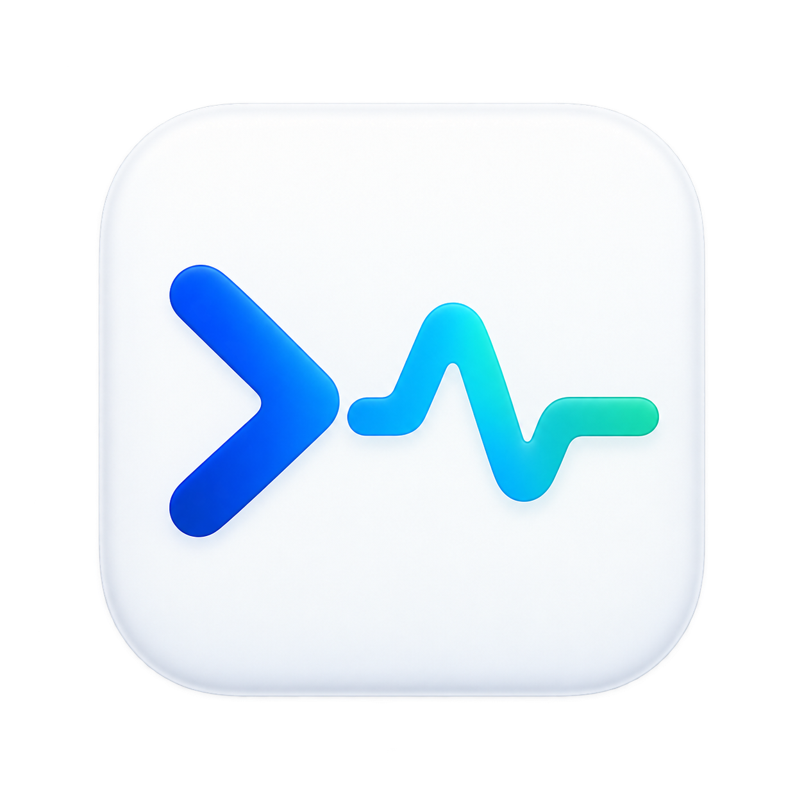

<p align="center">
  
</p>

<h1 align="center">Codex Pulse</h1>

<p align="center">轻量的 macOS 桌面悬浮窗，让 Codex 任务状态与账号剩余额度随时可见。</p>

<p align="center">macOS 14+ · Apple Silicon · SwiftUI / AppKit · MIT</p>

Codex Pulse 是一个独立的原生 macOS 小工具。它用简洁的白色界面展示正在运行的 Codex 任务，保留尚未查看的完成结果，并显示账号共享的剩余额度。窗口默认置顶，支持折叠和随任务数量自动调整高度。

本项目由社区独立开发，与 OpenAI 无隶属关系，也不是官方 Codex 产品。

## 功能

- **任务状态**：每 2 秒刷新本机未归档的主任务，隐藏内部审查和子代理记录。
- **完成结果保留**：任务完成后显示绿色「已完成 · 待查看」，在 Codex 中查看并清除未读状态后自动移除。
- **剩余额度**：每 30 秒查询账号用量，显示接口提供的 5 小时、每周等额度窗口、剩余比例与重置时间。
- **动态布局**：没有任务时主要显示额度；任务增多时窗口自动伸长，达到屏幕高度后列表可滚动。
- **桌面悬浮**：默认置顶，可拖动、调宽、折叠，也可通过菜单栏切换置顶。
- **快速返回**：点击任务打开对应的 Codex 对话。
- **可选提示音**：可在右下角菜单中开启完成提示音，默认关闭。

## 环境要求

| 项目 | 要求 |
| --- | --- |
| 系统 | macOS 14 或更新版本 |
| 芯片 | Apple Silicon（当前构建脚本输出 arm64） |
| Codex | 已安装并登录的 Codex 桌面应用，且已生成本机任务记录 |
| 编译 | Xcode Command Line Tools，包含 Swift 编译器 |
| 测试 | Python 3 |

任务状态来自本机记录；额度查询需要网络连接。当前用量客户端会在 `/Applications/ChatGPT.app`、`/Applications/Codex.app` 和 `~/Applications/Codex.app` 中寻找 Codex 可执行程序。

## 安装与启动

当前仓库提供源码。先在终端安装编译工具（已安装则跳过）：

```sh
xcode-select --install
```

然后克隆、构建并启动：

```sh
git clone https://github.com/xiaofan3837-commits/codex-pulse.git
cd codex-pulse
zsh build.sh
open "Codex Pulse.app"
```

构建完成后，可以把 `Codex Pulse.app` 拖入「应用程序」文件夹。退出后，从「应用程序」或 Spotlight 搜索 **Codex Pulse** 即可再次打开。

构建脚本会对应用进行本机临时签名；当前版本未进行 Apple 公证。应用包是构建产物，不提交到源码仓库。

## 使用方法

1. 打开 Codex 并运行任务，再启动 Codex Pulse。
2. 悬浮窗显示运行中的任务；完成但未查看的任务会保留在列表中。
3. 在 Codex 中查看结果后，对应完成项会自动移除。没有其他任务时，窗口收短并显示「目前没有进行中的任务」。
4. 顶部箭头折叠或展开窗口；关闭按钮仅隐藏窗口，点击菜单栏图标可重新显示。
5. 右下角刷新按钮手动更新任务与用量；更多菜单可开启提示音或退出应用。

为了等待 Codex 的任务状态和未读标记同步保存，刚完成的任务至少保留约 6 秒。如果任务完成时你已经在查看它，Codex 可能自动将结果标为已读。未查看的完成状态可在重启悬浮窗后恢复。

额度进度条表示**剩余比例**，与账号共享额度对应，不是单个任务的消耗。接口没有返回某个额度窗口时，该窗口不会显示；查询失败会保留上次数据并提示。

## 数据访问与兼容性

- 以只读方式查询 `~/.codex/state_5.sqlite` 和 `~/.codex/thread_history_1.sqlite` 中的任务元数据及最近一轮状态。
- 只读解析 `~/.codex/.codex-global-state.json` 中的未读标记，不修改 Codex 的任务或已读状态。
- 不查询对话正文、工具输出或登录凭据；窗口偏好和待查看的完成状态存储在应用自己的偏好设置中。
- 用量通过本机 Codex `app-server --stdio` 查询，仅发送初始化与 `account/rateLimits/read` 请求，不启动模型任务，也不兑换额度。
- 支持用 `CODEX_HOME` 指定本地任务记录目录；通过 Finder 启动时使用默认目录。

任务数据库和桌面未读记录属于 Codex 的内部格式，并非稳定公开接口。Codex 更新后可能需要调整适配器。读取失败时会提示并保留上次记录，不把未知状态当作已完成。未读记录存在多个账号或多个本地主机范围、无法确定适用范围时，会保留已跟踪的完成项，避免误清除。

当前只覆盖本机 Codex 主任务，不包含远程主机任务、ChatGPT 普通聊天或子代理。任务「已完成」表示最近一轮运行结束，不代表整个项目目标已达成。Codex 异常退出后，最后记录可能仍显示运行中。

更详细的说明见 [使用说明](使用说明.md)。

## 开发与测试

```text
Source/
  main.swift                悬浮窗、菜单栏与用量界面
  TaskStore.swift           本机任务记录读取与状态解析
  CompletionTracker.swift   完成结果保留与已读同步
  UsageStore.swift          账号额度查询
Tests/                      隔离数据测试与完成状态回归测试
Assets/                     PNG、ICNS 图标及设计说明
build.sh                    构建并签名 macOS 应用
```

重新构建并运行测试：

```sh
zsh build.sh
python3 -m unittest discover -s Tests -v
```

测试覆盖任务状态识别、会话存储 ID 迁移、只读访问、完成状态保留与清除，以及用量解析。测试使用隔离数据，不修改真实 Codex 任务。

可在本机诊断任务记录或用量连接：

```sh
"Codex Pulse.app/Contents/MacOS/CodexPulse" --diagnose
"Codex Pulse.app/Contents/MacOS/CodexPulse" --diagnose-usage
```

诊断输出可能包含任务标题和项目名称；提交问题时请先移除私人信息。

## 贡献

欢迎通过 Issues 反馈兼容性问题，或提交 Pull Request。报告问题时请说明 macOS 版本、芯片类型、Codex 版本和复现步骤；修改状态读取或完成保留逻辑时，请补充相应回归测试。

## 许可证

本项目采用 [MIT License](LICENSE)。Copyright © 2026 zinc (xiaofan3837-commits)。

图标的生成方式与设计记录见 [图标设计说明](Assets/图标设计说明.md)。Codex、OpenAI 及其相关商标归各自权利人所有。
